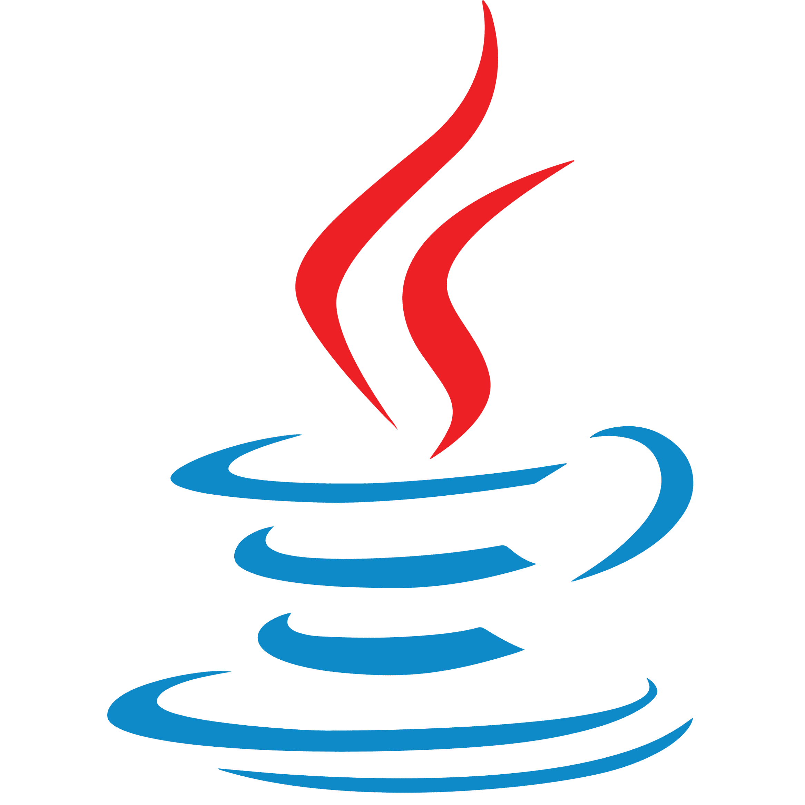
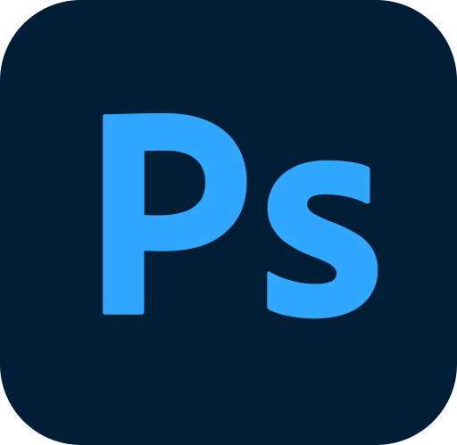
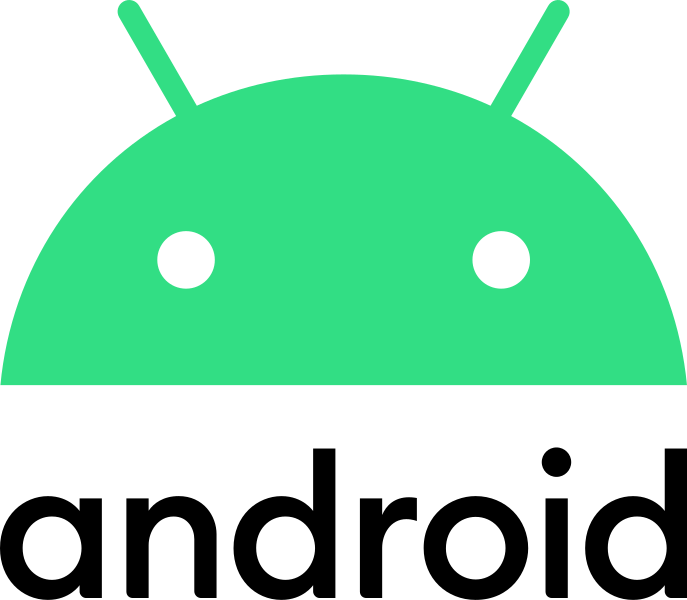

## Hi there, I'm Thomas 👋

### I am a student that likes Computer Science and Cybersecurity 

- 👨‍🎓 Most of my school assignments are stored on this accout
- 👨‍💻 I like to try and complete Root-Me challenges: [Parke](https://www.root-me.org/Parke)
- 👨‍💼 I'm not very active, but here is my LinkedIn acount: [Thomas](https://www.linkedin.com/in/thomasrabian/)
- 📫 You can reach me on this email address: thomas.rabian@protonmail.com
- ⚡ Fun fact: I play drums... Yeah, it's not really fun...

 

### Languages and Tools:

</a>

 

### Operating Systems

- Windows 
- Linux (Main distribution:  Ubuntu)
- Android